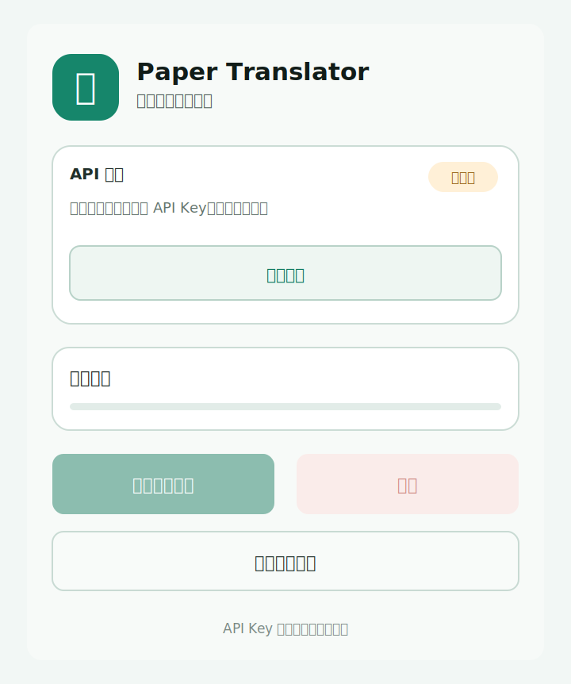
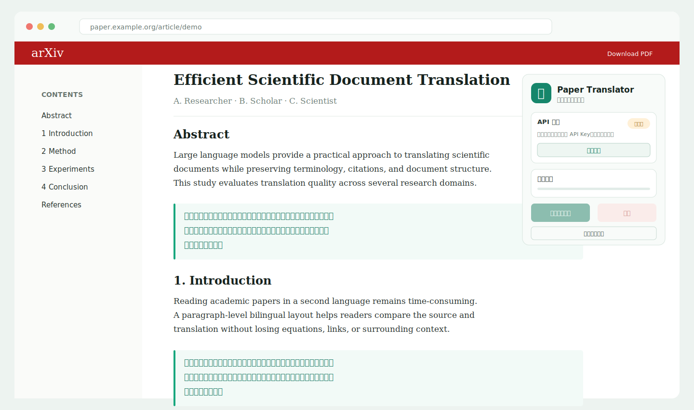

# Paper Translator

Paper Translator 是一个面向英文学术论文网页的开源中文翻译扩展。它保留网页原有 DOM 结构，支持双语显示与原位替换，并允许用户连接自己的 OpenAI、Anthropic、Gemini 或兼容 API。项目基于 Manifest V3、TypeScript、React 和 Vite，可用于 Chrome 与 Edge。

> 当前版本：`0.2.0`。项目不提供公共翻译代理，不收集用户数据，也不会把 API Key 上传到项目作者的服务器。

## 功能特性

- 一键翻译当前论文网页，保留标题、段落、链接和行内样式等原始 HTML 结构
- 段落级双语显示与原位替换，可随时恢复原文
- 快速、学术、精翻三种模式，默认使用学术模式
- 适配 arXiv、IEEE、ACM、Springer、Nature、ScienceDirect 与普通论文 HTML 页面
- 自动避开代码、公式、MathJax、KaTeX、参考文献、作者/机构元数据、DOI、URL 和邮箱
- 按文本节点与句子分块，支持可调并发、停止、超时和失败保留原文
- 对 429 和服务端错误执行指数退避重试；遇到上下文/token 超限自动缩小分块
- 可选择 Anthropic Messages、OpenAI Chat Completions、OpenAI Responses 或 Gemini generateContent 协议
- API 配置集中在完整设置网页中，并使用 `chrome.storage.local` 保存在本机浏览器
- 无遥测、无广告、无账户系统

## 截图

以下图片展示 Popup 与论文网页的双语翻译效果。





## 支持的 API

扩展根据用户选择自动切换请求路径、鉴权方式、请求体和响应解析：

| 接口协议                | 自动追加路径                      | 鉴权方式                          |
| ----------------------- | --------------------------------- | --------------------------------- |
| Anthropic Messages      | `/messages`                       | `x-api-key` + `anthropic-version` |
| OpenAI Chat Completions | `/chat/completions`               | Bearer API Key                    |
| OpenAI Responses API    | `/responses`                      | Bearer API Key                    |
| Gemini generateContent  | `/models/{model}:generateContent` | `x-goog-api-key`                  |

Chat Completions 模式继续兼容 OpenAI、DeepSeek、Qwen、GLM 及其他 OpenAI Compatible 服务。第三方聚合 API 的可用协议以对应服务商文档为准。

服务商的端点、模型 ID 和鉴权规则可能变化，请以对应服务商的官方文档为准。扩展不会把某一家服务商写死在代码中。

## 安装方法

### 从 Release 安装

1. 在 GitHub Releases 下载最新的 `paper-translator-v*.zip`。
2. 解压 ZIP。
3. 按下方 Chrome 或 Edge 步骤加载解压后的目录。

### 从源码安装

```bash
git clone https://github.com/TimPetrillo/paper-translator.git
cd paper-translator
npm install
npm run build
```

构建产物位于 `dist/`。

## 本地开发

环境要求：Node.js 20.19 或更高版本，npm 10 或更高版本。

```bash
npm install
npm run dev
```

首次启动后，在浏览器中加载开发服务器生成的 `dist/` 目录。修改源码时 Vite/CRXJS 会重新构建；扩展 Service Worker 或 manifest 发生变化后，需在扩展管理页点击“重新加载”。

常用命令：

```bash
npm run typecheck     # 严格 TypeScript 检查
npm run lint          # ESLint
npm run format:check  # Prettier 检查
npm run build         # 生产构建
npm run package       # 构建并在 release/ 生成 ZIP
```

## 构建方法

```bash
npm ci
npm run build
```

Vite 会将 Manifest V3、后台 Service Worker、内容脚本、Popup、Options 和静态资源输出到 `dist/`。如需可发布压缩包，运行：

```bash
npm run package
```

## Chrome 加载未打包扩展

1. 打开 `chrome://extensions/`。
2. 开启右上角“开发者模式”。
3. 点击“加载已解压的扩展程序”。
4. 选择项目中的 `dist/` 目录。
5. 建议把 Paper Translator 固定到工具栏。

Chrome 内置页面、Chrome Web Store 和部分受保护页面禁止内容脚本运行，这是浏览器安全限制。

## Edge 加载未打包扩展

1. 打开 `edge://extensions/`。
2. 开启“开发人员模式”。
3. 点击“加载解压缩的扩展”。
4. 选择项目中的 `dist/` 目录。

## 使用说明

1. 打开扩展 Popup，点击“打开配置”。
2. 在完整设置网页中填写 API Key、Base URL 和 Model Name。
3. 选择翻译模式、显示方式、并发数量和超时时间。
4. 点击“测试 API”确认兼容性。
5. 点击“保存配置”。
6. 打开论文 HTML 页面，点击“翻译当前页面”。
7. 可在翻译过程中点击“停止翻译”；点击“恢复原文”可撤销当前页的译文。

也可以使用快捷键 `Alt+Shift+T`。快捷键可在 `chrome://extensions/shortcuts` 或 `edge://extensions/shortcuts` 中修改。

### 翻译模式

| 模式     | 适合场景           | 分块策略                   |
| -------- | ------------------ | -------------------------- |
| 快速模式 | 浏览摘要、快速阅读 | 较大分块，提示词更简洁     |
| 学术模式 | 日常论文精读       | 平衡准确度、风格与成本     |
| 精翻模式 | 需要更细致中文表达 | 更小分块，更严格的译审提示 |

### 配置示例

以下仅说明字段格式，不对应真实服务商：

```text
接口协议:      OpenAI Chat Completions
API Key:       sk-your-api-key
Base URL:      https://api.example.com/v1
Model Name:    example-chat-model
翻译模式:      学术模式
显示方式:      双语显示
并发数量:      3
超时时间:      45 秒
```

Base URL 可填写协议根地址或对应协议的完整请求地址。插件会根据接口协议追加所需路径；若已经填写完整路径，则不会重复追加。

## 工作原理

```text
设置网页保存配置 → Popup 启动翻译 → Content Script 提取可见英文文本
                → 按文本节点/句子分块与并发调度
                → Background Service Worker 调用用户 API
                → Content Script 将译文写回原 DOM
```

API Key 只由扩展页面与后台 Service Worker 使用，不会写入论文网页 DOM。翻译内容会发送到用户主动配置的 API 服务；使用前请确认论文内容与所选服务商的数据政策相符。

## 论文网页适配说明

扩展会优先查找各站点的论文正文容器，并使用通用 `article`、`main`、`[role=main]` 作为回退。以下内容默认跳过：

- `script`、`style`、`svg`、`canvas`、`code`、`pre`、`kbd`、`samp`
- MathJax、KaTeX、MathML 与独立 LaTeX 公式
- 参考文献/书目区域
- 完整 DOI、URL、邮箱、图表编号与公式编号
- 常见作者和机构元数据容器，以及短姓名/机构文本

页面结构经常变化。如果某个站点漏译或误译，请提交 issue，并提供页面 URL、浏览器版本和脱敏后的 DOM 片段。

## 隐私策略

- 扩展不收集、分析、出售或同步用户数据。
- API Key 与设置仅存储在 `chrome.storage.local`；未使用 `storage.sync`。
- 只有用户点击测试或翻译时，必要文本才发送到用户指定的 API。
- 扩展没有项目方控制的后端服务器。
- `<all_urls>` 权限用于读取当前论文页并访问用户自定义 API 域名；它不代表扩展会后台扫描浏览历史。
- 删除扩展通常会移除其本地存储；也可在 Options 页面点击“清除配置”。

详见 [PRIVACY.md](PRIVACY.md) 与 [SECURITY.md](SECURITY.md)。

## 常见问题

### 为什么提示“当前页面未加载扩展脚本”？

安装或重新加载扩展前已经打开的页面需要刷新。浏览器内置页、扩展商店、PDF 查看器和其他受保护页面无法注入内容脚本。

### 为什么 API 测试成功，但翻译出现 429？

并发翻译比单次测试请求密集。请降低并发数量，检查服务商额度与速率限制。扩展会自动退避重试，但无法绕过服务商限制。

### 为什么部分文本保留英文？

公式、参考文献、姓名、机构、DOI 等会主动跳过；失败分块也会保留原文，以避免破坏页面。Popup 会显示失败数量。

### 为什么 Base URL 返回 404？

确认接口协议选择正确，且 Base URL 包含服务商要求的版本路径。插件会按协议追加 `/messages`、`/chat/completions`、`/responses` 或 `/models/{model}:generateContent`；也可以直接填写完整请求地址。

### 能翻译 PDF 吗？

当前版本面向论文 HTML 页面。浏览器 PDF 查看器通常不允许内容脚本访问文本；PDF 支持在路线图中。

### 配置是否会被上传？

不会上传到本项目。API Key 会按照所选协议，通过 Bearer、`x-api-key` 或 `x-goog-api-key` 发送到你填写的 API 地址，这是完成请求所必需的。请只使用可信的 HTTPS 端点。

## 项目结构

```text
paper-translator/
├── .github/                 # CI、Issue 与 PR 模板
├── docs/images/             # README 界面截图与示意图
├── public/icons/            # 扩展图标
├── scripts/                 # 发布 ZIP 脚本
├── src/
│   ├── api/                 # 多协议翻译 API 客户端
│   ├── background/          # MV3 Service Worker
│   ├── content/             # DOM 提取、渲染与页面协调器
│   ├── options/             # 独立设置页
│   ├── popup/               # Popup UI
│   ├── storage/             # chrome.storage.local
│   ├── translator/          # Prompt、分块、并发队列
│   ├── types/               # 严格类型定义
│   └── utils/               # 错误与消息工具
├── manifest.json
├── vite.config.ts
└── package.json
```

## 路线图

- [ ] 站点适配回归测试与可配置规则
- [ ] 术语表与术语一致性缓存
- [ ] 仅翻译选中内容
- [ ] 翻译结果本地缓存与页面内控制条
- [ ] 流式响应与更细粒度进度
- [ ] PDF 文本层支持
- [ ] Chrome Web Store / Edge Add-ons 自动发布流程
- [ ] 国际化 UI

## 贡献指南

欢迎 bug 修复、站点适配、无障碍改进和文档贡献。提交前请阅读 [CONTRIBUTING.md](CONTRIBUTING.md)，并确保以下命令通过：

```bash
npm run format:check
npm run lint
npm run typecheck
npm run build
```

安全问题请不要公开提交 issue，请按 [SECURITY.md](SECURITY.md) 中的方式报告。

## License

本项目使用 [MIT License](LICENSE)。
